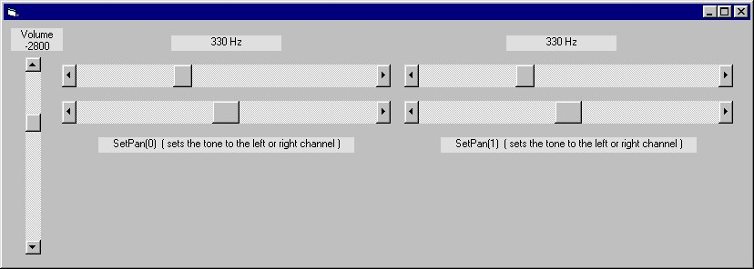



## A Simple Sine Wave Generator \(DirectSound\)

### Description

Please Vote. Sine wave generator 3390 Byte. Simple code. Calculates a sine wave and plays the wave from Ram - no wave file *.wav. You can change the frequency with a slider. There is no "crackling sound" in the loudspeaker when changing the frequency or volume.
 
### More Info
 
Methods:

DSB(0).SetFrequency

DSB(0).SetVolume

DSB(0).SetPan

DSB(0).Play

DS.CreateSoundBuffer

             |
---                |---
**Submitted On**   |2005-11-13 09:40:12
**By**             |[vb\_elmar](https://github.com/Planet-Source-Code/PSCIndex/blob/master/ByAuthor/vb-elmar.md)
**Level**          |Intermediate
**User Rating**    |4.3 (17 globes from 4 users)
**Compatibility**  |VB 6\.0
**Category**       |[DirectX](https://github.com/Planet-Source-Code/PSCIndex/blob/master/ByCategory/directx__1-44.md)
**World**          |[Visual Basic](https://github.com/Planet-Source-Code/PSCIndex/blob/master/ByWorld/visual-basic.md)
**Archive File**   |[Sine\_wave\_19480411132005\.zip](https://github.com/Planet-Source-Code/vb-elmar-a-simple-sine-wave-generator-directsound__1-63252/archive/master.zip)

### API Declarations

GetForegroundWindow

